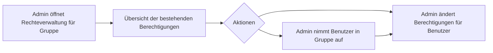
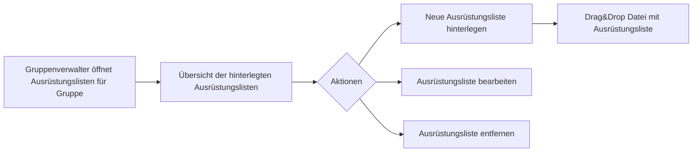
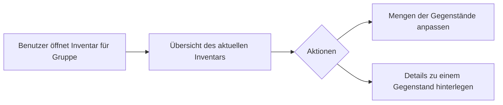
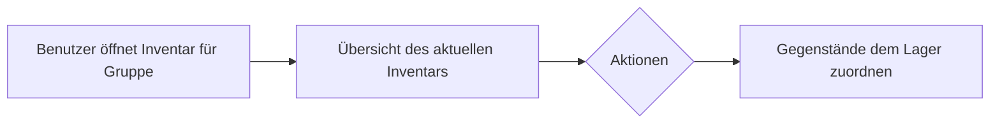
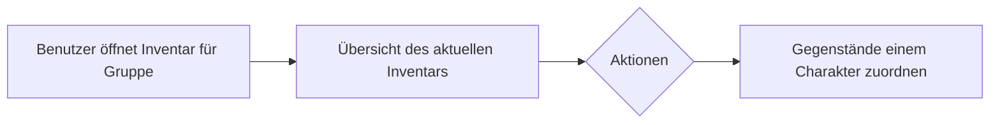
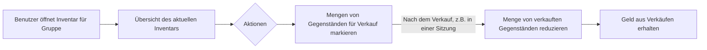

# Konzept
## Zusammenfassung

Die Website soll die Verwaltung von Rollenpsiel Inventar erleichtern und bestehende Spreadsheets ablösen.

## Anwendungsfälle
### Inventar für eine Gruppe einrichten

### Simple Berechtigungen

Berechtigungen:
 - Admin
 - Gruppenverwalter
 - Benutzer

### Ausrüstungslisten für eine Gruppe hinterlegen

#### Ausrüstungsliste
 - Name
 - Gegenstände(Liste)
  - Name
  - Kategorie
  - Schlagworte
  - Preis

### Ausrüstungspakete für eine Gruppe hinterlegen

#### Ausrüstungspakete
 - Name
 - Aurüstungsliste
 - Gegenstände

### Gegenstände erhalten

### Gegenstände einlagern

### Gegenstände verteilen

### Gegenstände verkaufen

